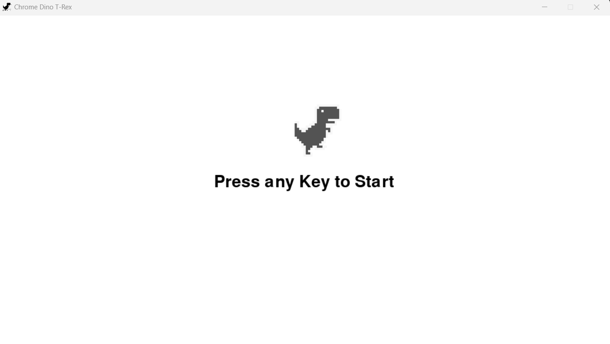

# Chrome Dino T-Rex

## معرفی پروژه
در این درس شما باید به عنوان پروژه بازی معروف 
Dino T-Rex 
را با استفاده از کتابخانه 
**Pygame**
و به زبان پایتون پیاده‌سازی کنید.

## منابع آموزشی
برای یادگیری کتابخانه 
Pygame
و پیاده‌سازی پروژه، شما ملزم به استفاده از هیچ کدام از منابع زیر نیستید!

این منابع صرفا از طرف ما به شما معرفی می‌شود تا شما را در یادگیری این کتابخانه یاری کند.

- [Pygame Tutorial]() 

- [Making Dino Runner with Pygame]()

تمامی تصاویر مورد نیاز شما برای پیاده‌سازی این بازی داخل فولدر assets موجود است، شما می‌توانید با کلیک برروی لینک زیر آن‌ها را دانلود کنید و از آن‌ها استفاده کنید.
- [Project Assets](https://github.com/sut-py/Spring2024-Project/archive/refs/heads/main.zip)

# ملزومات فاز اول
فاز اول این پروژه به جز بازی اصلی، نیازمند پیاده‌سازی موارد دیگری هستید که در ادامه آن‌ها را توضیح می‌دهیم.

**توجه کنید که استفاده از اصول شی‌گرایی در پروژه اجباری است و دوستانی که این اصول را استفاده و رعایت نکنند نمره‌‌ی پروژه را نمی‌گیرند!**

### صفحه شروع بازی

بازی شما باید دارای یک صفحه شروع باشد که دارای ویژگی‌های زیر است:

- لوگوی بازی را روی صفحه نشان دهد
- یک متن راهنما روی صفحه نشان دهد که به کاربر بگوید تا یک کلید دلخواه را بزند
- بالاترین رکورد کاربر را نمایش دهد(اختیاری)

 

### دایناسور
 دایناسور شما باید مدام بین 2 عکس سوییچ کند تا حالت دویدن داشته باشد و ویژگی‌های زیر را داشته باشد:

 - داشتن حالت دویدن تا قبل از برخورد به مانع
 - پریدن با استفاده از یک کلید خاص
 - نشستن با استفاده از یک کلید خاص

**جزئیات پیاده‌سازی هر یک از این موارد داخل منابع آموزش پروژه وجود دارد.**

### موانع
در این بازی تعدادی مانع برای حرکت دایناسور وجود دارد که در ادامه به آن‌ها اشاره می‌کنیم.
این موانع باید در فواصل مشخص جلوی راه دایناسور ظاهر شوند.
انتخاب این که کدام یک از انواع موانع ظاهر می‌شود به صورت کاملا رندوم و با احتمال یکسان است.

انواع موانع:

- Cactus
  - Large Cactus 1
  - Large Cactus 2
  - Large Cactus 3
  - Small Cactus 1
  - Small Cactus 2
  - Small Cactus 3

- Bird
  - High Bird
  - Low Bird
  

### کاکتوس

کاکتوس‌ها یکی از موانع طبیعی بازی ما هستند که با برخورد به دایناسور، آن را متوقف می‌کنند.

ویژگی‌های کاکتوس:

- باید چند نوع کاکتوس مختلف داشته باشیم که شکل‌های متفاوت دارند
- کاکتوس‌ها می‌توانند در فواصل یکسان و مشخص در مسیر قرار بگیرند
- در هر یک از فواصل مشخص باید یکی از انواع کاکتوس را به صورت تصادفی قرار بگیرد
- دایناسور در صورت برخورد با این مانع باید بمیرد
- دایناسور فقط می‌تواند از روی این مانع بپرد

### پرنده

پرنده‌ها یکی از موانع طبیعی بازی ما هستند که با برخورد به دایناسور، آن را متوقف می‌کنند.

 

ویژگی‌های پرنده:

- ما 2 نوع پرنده داریم که یکی از آن‌ها‌ در بلندی پرواز می‌کند و یکی از آن‌ها در پستی پرواز می‌کند
- پرنده‌ها می‌توانند در فواصل یکسان و مشخص در مسیر قرار بگیرند
- در هر یک از فواصل مشخص باید یکی از انواع پرنده را به صورت تصادفی قرار بگیرد
- دایناسور در صورت برخورد با این مانع باید بمیرد
- بسته به نوع پرنده، دایناسور باید از روی این پرنده بپرد و یا بنشیند و زیر آن عبور کند

**راهنمایی: برای پیاده‌سازی این مانع باید از اصل Inheritance در شی‌گرایی استفاده کرد.**

### منظره بازی
منظره بازی شامل 2 مورد است، ابر و زمین.
ابرها در آسمان به صورت رندوم و با احتمال حدودا 0.2 در طی مسیر در آسمان برای زیبایی نمایش داده می‌شود و تاثیری در بازی ندارد.

### امتیازدهی
شما باید به ازای هر بار تکرار حلقه‌ی run بازی، یک امتیاز به امتیاز فعلی اضافه کنید و هربار که دایناسور می‌میرد امتیاز را داخل یک فایل ذخیره کنید.
همچنین هنگامی که بازی شروع می‌شود باید بیشترین امتیاز قبلی را از روی آن فایل حساب کرده و در بالای صفحه به همراه امتیاز فعلی به کاربر در حال بازی نمایش دهید. چنانچه هنگام بازی، امتیاز فعلی از بیشینه امتیازهای قبلی بیشتر شد، باید بیشینه امتیازات هم به همراه امتیاز فعلی در بالای صفحه update شود و نباید ثابت بماند.

> **برای ذخیره دیتای امتیازها می‌توانید همه امتیازهارا روی یک فایل بنویسید و هر بار که بازی در ابتدا run می‌شود شما اقدام به محاسبه ماکزیمم آن امتیازها کنید، اما این کار به مرور زمان از سرعت لود شدن برنامه شما می‌کاهد و باعث می‌شود تعداد زیادی دیتای اضافی ذخیره کنید و فضای زیادی اشغال کنید. راهکار پیشنهادی این است که از دیتابیس استفاده کنید و یا فقط امتیاز ماکزیمم را داخل فایل بنویسید وهمه امتیازهارا ننویسید.**
