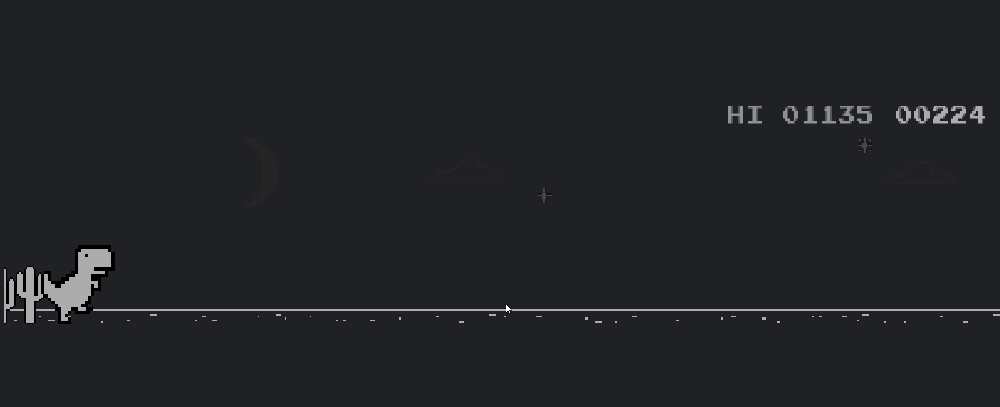

## معرفی فاز سوم پروژه

در این فاز شما باید با استفاده از کتابخانه‌های پایتون، برای بازی اصلی یک 
Cheat بسازید تا به صورت خودکار این بازی را انجام دهد و تا ابد کسب امتیاز کند.

>**توجه کنید که نمره‌ی این فاز امتیازی است و اجباری برای زدن این فاز وجود ندارد. اما برای گرفتن نمره امتیازی این فاز شما باید حداقل نیمی از مجموع نمرات فاز اول و دوم را کسب کرده باشید تا نمره‌‌ی امتیازی این فاز برای شما حساب شود.**

## منابع آموزشی
برای زدن این فاز و یادگیری کتابخانه‌های مربوطه، منابع آموزشی متعددی در سطح اینترنت وجود دارد که شما مجاز هستید از تمامی آن‌ها استفاده کنید و اجباری از این بابت وجود ندارد. ما هم تعدادی از منابع آموزشی مورد تایید خودمان را به شما معرفی می‌کنیم تا در صورت نیاز از آن‌ها استفاده کنید.

> **توجه کنید که کپی کردن کدهای آماده‌ی در سطح اینترنت ممکن از منجر به تقلب گرفتن از شما شود. زیرا ممکن از شخص دیگری هم همان کدها را کپی کند و شما با آن فرد تقلب بخورید و نمره‌ی این فاز شما به کل 0 لحاظ شود.**


# ملزومات فاز سوم
در این فاز شما میتوانید به 2 صورت مختلف برای بازی اصلی یک
Cheat
بسازید.
روش دوم به مراتب ساده‌تر از روش اول است و به‌طبع نمره‌ی کمتری هم دارد.
شما می‌توانید هر دو روش را بزنید و نمره‌ی هر دو را کسب کنید.

برای باز کردن بازی روی مرورگر کروم خود، میتوانید این url را داخل مرورگر کروم خود تایپ کرده و Enter بزنید:
```
chrome://dino
```
## روش اول

در این بخش شما باید با استفاده از کتابخانه‌‌‌های `PIL`
و `PyAutoGUI`
برای بازی اصلی یک چیت بسازید.

کتابخانه `PIL (Python Imaging Library)` یک ابزار قدرتمند برای پردازش و ویرایش تصاویر در زبان پایتون است. این کتابخانه قابلیت‌های متنوعی مانند باز کردن، دستکاری، فیلترگذاری، تغییر اندازه، تبدیل فرمت و ذخیره‌سازی تصاویر را ارائه می‌دهد. با استفاده از PIL، برنامه‌نویسان می‌توانند به سادگی عملیات مختلفی بر روی تصاویر انجام دهند.

کتابخانه `pyautogui` یک کتابخانه پایتون برای خودکارسازی کنترل ماوس و کیبورد است. این ابزار به برنامه‌نویسان امکان می‌دهد تا عملیات‌های مختلفی مانند حرکت ماوس، کلیک کردن، تایپ کردن متن، گرفتن اسکرین‌شات و تشخیص تصاویر را به صورت خودکار انجام دهند. `pyautogui` برای خودکارسازی کارهای تکراری، تست نرم‌افزار و ایجاد اسکریپت‌های اتوماسیون بسیار مفید است. این کتابخانه با ارائه تاخیرهای قابل تنظیم بین عملیات‌ها، رفتارهای طبیعی‌تری را شبیه‌سازی می‌کند.

- [Create a Bot to Play Dino-Runner](https://www.youtube.com/watch?v=ktW5QXR6ZpQ)
- [Automate Chrome Dinosaur Game Using Python](https://www.youtube.com/watch?v=UBLLtJG3lLw)

> آموزش‌های فوق به گونه‌ای است که این اسکریپت بسته به سایز صفحه‌نمایشی که با آن کد را زدید کار می‌کنند و ممکن است روی یک سیستم دیگر با صفحه‌نمایشی دیگر، به درستی کار نکند. حل کردن این مشکل و زدن کدی که روی سیستم‌های متفاوت به درستی کار کند، نمره‌‌ی ویژه‌ای دارد.

## روش دوم
در این بخش شما باید با استفاده از کتابخانه `selenium`
یک اسکریپت مخرب جاوااسکریپت را به یک صفحه ی وب تزریق کنید و آن را اجرا کنید.

اسکریپت‌های مخرب زیادی برای تقلب در بازی Dino Runner وجود دارد. شما می‌توانید به دلخواه از یکی از آن‌ها استفاده کنید و این بخش اهمیتی ندارد. کار اصلی شما این است که چطور باید این اسکریپت را روی یک صفحه‌ی وب خاص با استفاده از کتابخانه `selenium` اجرا کنید.

این اسکریپت تابع باختن بازی را حذف میکند و شما هیچوقت نخواهید باخت:
```js
Runner.instance_.gameOver = () => {}
```

این اسکریپت سرعت داینو را صفر می‌کند و باعث می‌شود که دینو بدون برخورد با موانع جلو برود:
```js
Runner.instance_.setSpeed(0);
```

این اسکریپت باعث می‌شود که داینو هیچ‌وقت با موانع برخورد نکند و بازی تمام نشود:
```js
Object.defineProperty(Runner.instance_.tRex, 'collisionBoxes', { get: () => [] });
```

این اسکریپت امتیاز شما را به مقدار دلخواه افزایش می‌دهد. عدد 12345 را می‌توانید با امتیاز دلخواه خود جایگزین کنید:
```js
Runner.instance_.distanceRan = 12345 / Runner.instance_.distanceMeter.config.COEFFICIENT;
Runner.instance_.distanceMeter.update(12345);
```

این اسکریپت سرعت بازی را تغییر می‌دهد. عدد 1000 را می‌توانید با سرعت دلخواه خود جایگزین کنید:
```js
Runner.instance_.setSpeed(1000);
```

این اسکریپت باعث می‌شود که داینو به طور خودکار وقتی به موانع نزدیک می‌شود، بپرد:
```js
setInterval(function() {
    Runner.instance_.tRex.setJumpVelocity(10);
}, 100);
```

> نیازی نیست شما به اسکریت های جاوا اسکریپت فوق مسلط باشید، شما صرفا باید یکی از این اسکریپت ها را به دلخواه داخل کد پایتون خودتون کپی کنید تا داخل مرورگر اجرا شود!

**برای این بخش ویدیو آموزشی قرار نمیدهیم. خودتون راجع به رندر کردن کد js داخل یک وبسایت با استفاده از  python selenium تحقیق کنید.**
